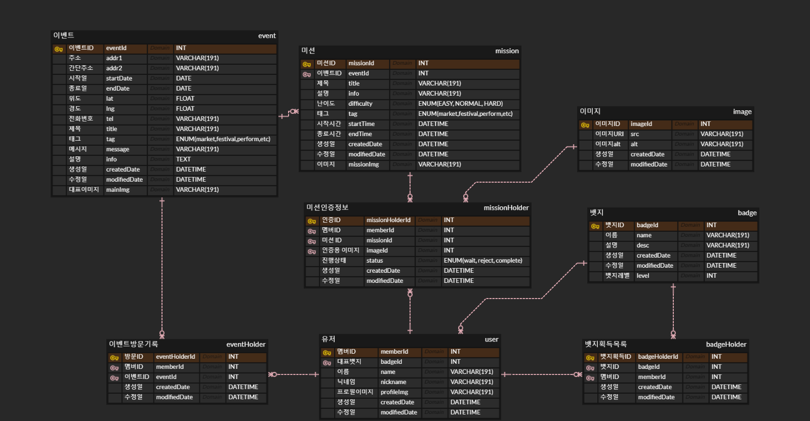
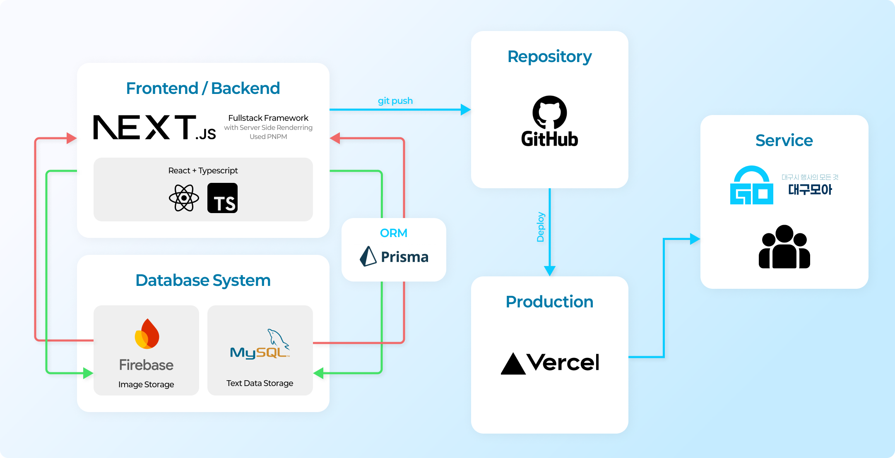
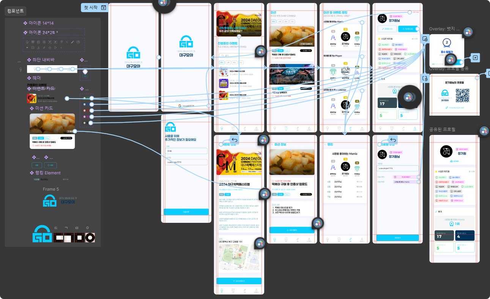

# 반짝반짝작은별 - 대구모아

## 서비스 요약

‘대구모아’는 시민들에게 이벤트에 관련된 정보와 미션을 제공해 시민들의 이벤트 참여를 촉구하는 앱웹입니다. ‘대구모아’는 시민들이 대구에서 활동하는 것들을 기록하며 이에 대한 보상을 제공합니다.

## 주제 구분

- C타입 대구 지역 상권을 살리는데 도움을 주는 서비스

## 팀원 소개

|  |  |  |  |
| :------------------------------------------------------------------------------------------: | :--------------------------------------------------------------------------------------: | :--------------------------------------------------------------------------------------------: | :--------------------------------------------------------------------------------: |
|                         **[권선우](https://github.com/ahapwhs0414)**                         |                        **[박재민](https://github.com/jamie2779)**                        |                         **[장기원](https://github.com/whitedev7773)**                          |                      **[황부연](https://github.com/ArpaAP)**                       |
|                                             기획                                             |                                           개발                                           |                                         개발 / 디자인                                          |                                        개발                                        |

## 시연 영상

(필수) Youtube 링크
(선택) Github Repository 페이지에서 바로 볼 수 있도록 넣어주셔도 좋습니다.

## 서비스 소개

### 서비스 개요

‘대구모아’는 크게 4가지 페이지를 가집니다. 1번째는 이벤트입니다. 이벤트는 대구에서 진행되는 축제, 야시장, 강연 등의 정보를 얻을 수 있습니다. 제공되는 정보는 이벤트의 이름, 포스터, 주최, 위치, 기간, 세부 설명입니다. 각각의 이벤트의 정보를 쉽고 편하게 확인할 수 있습니다. 또한 위치 인증 기능을 통해 이벤트에 참여한 것을 기록할 수 있습니다. 2번째는 미션입니다. 미션은 ‘대구모아’만의 특별한 기능입니다. ‘야시장 정복하기’, ‘축제 마스터’ 등 대구에서 일어나는 이벤트와 관련된 여러가지 미션을 제공해주며 이 미션을 해결할 시 뱃지와 보상을 제공합니다. 뱃지는 마이페이지를 꾸미는 것에 사용할 수 있습니다. 보상은 미션에 따라 다르게 제공될 예정입니다. 3번째는 랭킹입니다. ‘가장 많이 시장에 방문한 사람’, ‘가장 많은 축제에 참여한 사람’ 등 여러가지 랭킹을 볼 수 있으며 이는 자신이 얼마나 많은 대구의 이벤트에 참여하는지 알 수 있는 지표가 됩니다. 4번째는 마이페이지입니다. 마이페이지는 자신의 정보와 수집한 뱃지들, 그리고 통계를 제공합니다. 마이페이지는 자신이 획득한 뱃지와 자신의 랭킹으로 꾸밀 수 있으며, 통계에서는 참여한 행사 수, 둘러본 시장 수 등 여러가지 정보를 제공합니다.

### 타서비스와의 차별점

- 축제와 시장 정보 열람 가능
- 외부에서 사용할 일이 많을 것을 예상되므로 Mobile 유저 친화적
- PC 웹도 정상적으로 동작하도록 `css - @media`를 이용한 반응형 스타일 적용
- 미션이라는 차별화된 기능을 통해 흥미를 불러일으킴
- 뱃지라는 기능을 통해 사람들의 참여 유도

### 구현 내용 및 결과물

서비스의 실제 구현 내용과 결과물을 기재한다.

1. 로그인 및 회원가입

- 구글을 통해 간편하게 가입

2. 이벤트 목록
3. 이벤트 정보

- 카카오 맵 API를 통해 지도 연동, 해당 이벤트의 위치 확인이 편리
- GPS를 통해 이벤트(시장, 축제) 참여 여부 인증

4. 미션 목록

- 미션별 남은 시간과 장소 등을 한눈에 확인 가능

5. 미션 세부정보

- 사진 업로드를 통한 미션 수행

6. 랭킹 페이지
7. 프로필
   -> 획득한 뱃지 확인 및 대표 뱃지 설정 가능
   -> 개인 통계 열람

8. 관리자용 미션 인증 페이지
   -> 유저들이 올린 사진들을 보고 인증여부를 판단
   -> 테스트를 위해 관리자 권한 인증은 제거 해둔 상태입니다, user권한으로도 테스트 해볼 수 있습니다

### 구현 방식

> FE/BE: Next.js (React + TypeScript)

> Image Storage: Firebase
>
> MySQL ORM: Prisma

 

> Production: Vercel

 

> Design: Figma

## 향후 개선 혹은 발전 방안

- 메인 페이지 상단 배너광고 활성화
- 관리자 페이지 체계화
- 축제나 시장측과 협의하여 상품을 줄 수 있는 미션들 진행
- 지속적인 뱃지 및 미션 업데이트
